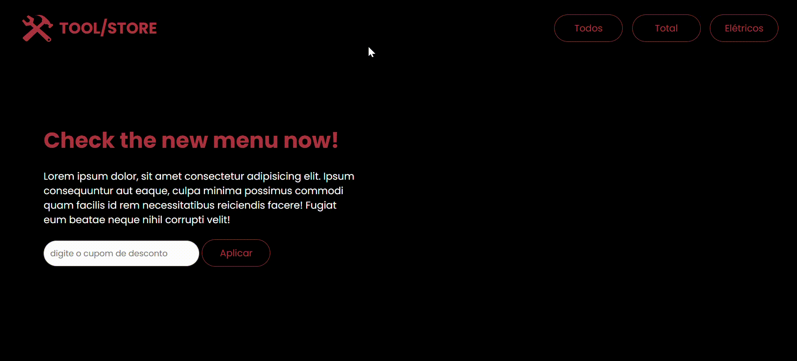

# Tool Store 
Landing page responsiva desenvolvida com foco no treinamento prático dos métodos de array do JavaScript: forEach(), map(), reduce() e filter(). O projeto simula uma pequena vitrine interativa onde os dados são manipulados dinamicamente por meio desses métodos.

## 💻 Demonstração

🔗 [Acesse aqui a versão online](https://victorbonifac10.github.io/tool-store/)

## ✨ Recursos

- HTML5
- CSS3 
- JavaScript
- Design responsivo
- Código limpo e organizado

## 📌 Observações

Este projeto foi desenvolvido com o objetivo de aprimorar habilidades em Lógica de programação, DOM e manipuação de lista em JavaScript.

## 📬 Contato

- [GitHub Profile](https://github.com/VictorBonifac10) 
- [LinkedIn](https://www.linkedin.com/in/victor-alves-bonifacio/)
